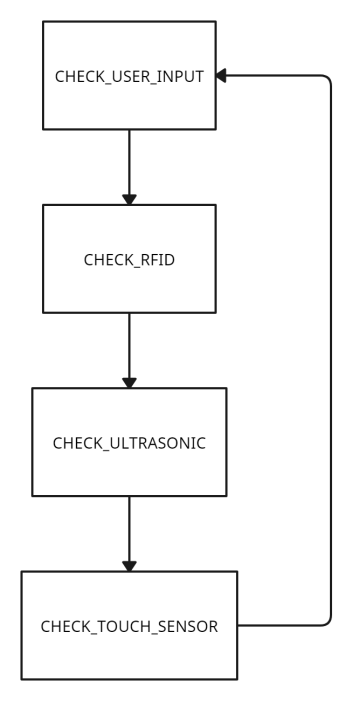

# Porte de garage sécurisée - Projet Arduino 1

Ce projet consiste en la création d'un système de contrôle d'accès pour une porte de garage sécurisée en utilisant une carte Arduino. Le système permet l'ouverture et la fermeture de la porte via différents modes d'authentification, tout en assurant la sécurité des biens et des personnes. De plus, il informe les utilisateurs de l'état du système et envoie des notifications en cas d'événements importants.

## Fonctionnalités

Le projet utilise un ensemble de capteurs et d'actuateurs pour créer un système de contrôle d'accès flexible et polyvalent. Les principales fonctionnalités du système comprennent :

- Enregistrement des informations d'accès dans la mémoire vive (EEPROM)
- Contrôle d'un élément motorisé (ex. verrou électrique)
- Mécanisme d'autocontrôle basé sur un capteur à ultrasons
- Détection de toucher tactile avec un capteur capacitif
- Interaction avec un ordinateur pour visualiser l'historique des accès

## Matériel requis

- Arduino Uno ou compatible
- Module RFID MFRC522
- Capteur à ultrasons HC-SR04
- Capteur tactile capacitif
- LED et résistances appropriées
- Transistor et diode pour contrôler un moteur ou un verrou électrique
- Câbles de connexion et breadboard

## Logiciel requis

- IDE Arduino
- Bibliothèques Arduino : SPI, MFRC522, EEPROM, TimeLib

## Fonctionnement du système

Le système suit un cycle d'états, où chaque état représente une étape du processus de contrôle d'accès. Les états sont :

1. CHECK_RFID : Vérifie si une carte RFID est présente et si l'ID de la carte correspond à l'ID autorisé.
2. CHECK_ULTRASONIC : Utilise le capteur à ultrasons pour détecter la proximité d'un objet et active l'élément motorisé si les conditions sont remplies.
3. CHECK_TOUCH_SENSOR : Vérifie si le capteur tactile est activé et effectue des actions en conséquence.
4. CHECK_USER_INPUT : Attend les entrées de l'utilisateur via l'ordinateur pour afficher l'historique des accès ou quitter le programme.

## Conclusion

Ce projet de contrôle d'accès offre une solution polyvalente et adaptable pour sécuriser les espaces et les ressources. Les différentes fonctionnalités peuvent être étendues ou modifiées en fonction des besoins spécifiques, et le système peut être intégré à d'autres dispositifs de sécurité ou de surveillance pour créer une solution de sécurité complète.

## Shéma

